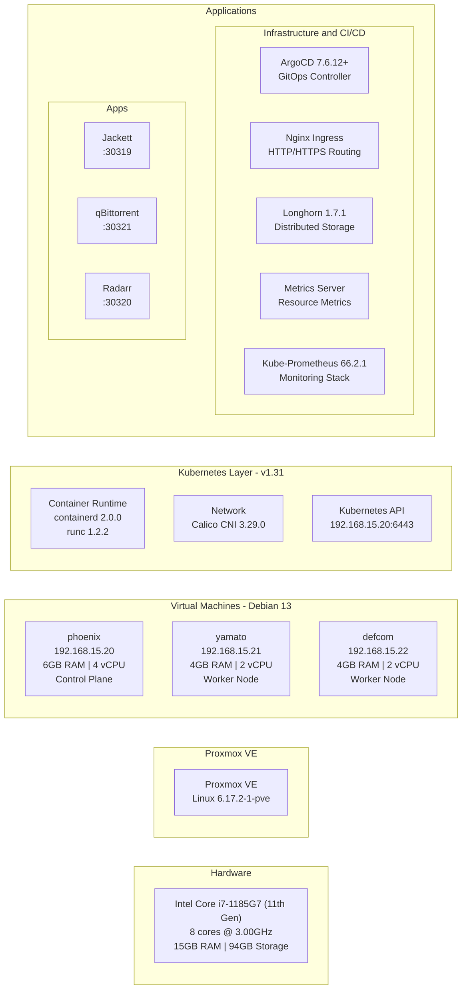

## Homelab

General-purpose Kubernetes homelab for self-hosted services and infrastructure experimentation. Managed via GitOps with ArgoCD. Configuration and bootstrapping handled by Ansible. All manifests and infrastructure code versioned in this repository.

### Current Infrastructure

**Proxmox VMs running Debian 13**

- **phoenix** (192.168.15.20) - 6GB RAM, 4 vCPU - Control Plane
- **yamato** (192.168.15.21) - 4GB RAM, 2 vCPU - Worker Node
- **defcom** (192.168.15.22) - 4GB RAM, 2 vCPU - Worker Node

Provisioned via Packer template + Terraform. See `proxmox/README.md`.

### Infrastructure Overview



### Stack
- Kubernetes 1.31 (kubeadm)
- containerd 2.0.0 / runc 1.2.2
- Calico CNI 3.29.0
- ArgoCD 7.6.12+ (Helm)
- Longhorn 1.7.1 (distributed block storage)
- nginx-ingress (bitnami/11.6.0)
- kube-prometheus 66.2.1 + Metrics Server

### Deployed Applications

**Infrastructure**
- **ArgoCD** - GitOps continuous delivery controller
- **Nginx Ingress** - HTTP/HTTPS routing and load balancing
- **Longhorn** - Distributed block storage with replication
- **Metrics Server** - Resource metrics (CPU/memory) for HPA and kubectl top
- **Kube-Prometheus** - Full monitoring stack (Prometheus, Grafana, Alertmanager)

**Media Management**
- **Jackett** - Torrent indexer proxy/aggregator
- **qBittorrent** - BitTorrent client (hostNetwork mode)
- **Radarr** - Movie collection manager and automation

### Initial Setup

1. **(Optional) Provision Proxmox VMs**: Use Packer to create Debian template, Terraform to provision 3 VMs (phoenix, yamato, defcom). See `proxmox/README.md`.

2. **Run Ansible playbooks** (from `ansible/` directory):
   ```bash
   cd ansible/
   ansible-playbook -i inventory.yaml controlplane.yaml
   ansible-playbook -i inventory.yaml nodes.yaml
   ansible-playbook -i inventory.yaml argocd.yaml
   ```

3. **Create Kubernetes user**:
   ```bash
   ./scripts/create-k8s-user.sh <user> # left empty for cflor
   ```

### Access

**ArgoCD** - https://192.168.15.20:30443
- Username: `admin`
- Password: `kubectl get secret argocd-initial-admin-secret -n argocd -o jsonpath='{.data.password}' | base64 -d`

**Jackett** - http://192.168.15.20:30319

**qBittorrent** - http://192.168.15.20:30321

**Radarr** - http://192.168.15.20:30320

**Longhorn** - http://192.168.15.20:30318

### Configure Kubelet TLS Bootstrap

```bash
ansible all -b -i inventory.yaml -a "echo 'serverTLSBootstrap: true' >> /var/lib/kubelet/config.yaml" -m shell
ansible all -b -i inventory.yaml -a "sudo systemctl restart kubelet" -m shell
```

### Documentation

For detailed documentation on repository structure, deployment workflows, gotchas, and code conventions, see [CLAUDE.md](./CLAUDE.md).
